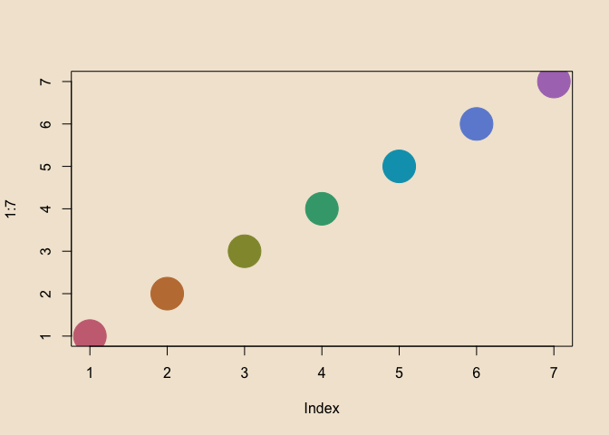

<!-- README.md is generated from README.Rmd. Please edit that file -->

# penumbra

<!-- badges: start -->

<!-- badges: end -->

This is an R package based on Neal McKee’s [penumbra color
palette](https://github.com/nealmckee/penumbra/).

From the original:

> Penumbra is a mathematically balanced colour scheme constructed in a
> perceptually uniform colour space with base colours inspired by the
> shades of colour occuring in nature due to the light of the sun and
> the sky. It cleanly separates the perceptual properties of colours
> while optimally utilising the available colour space of typical
> displays.

> …

> The accent colour palettes also lend themselves to encoding
> quantitative information in data visualisations.

## Installation

You can install the development version of penumbra like so:

``` r
remotes::install_github("hughjonesd/penumbra")
```

## Example

``` r
library(penumbra)

par(bg = penumbra::base_pal(n = 3)[3])
palette(penumbra::color_pal(n = 7))
plot(1:7, pch = 19, cex = 5, col = 1:7)
```


